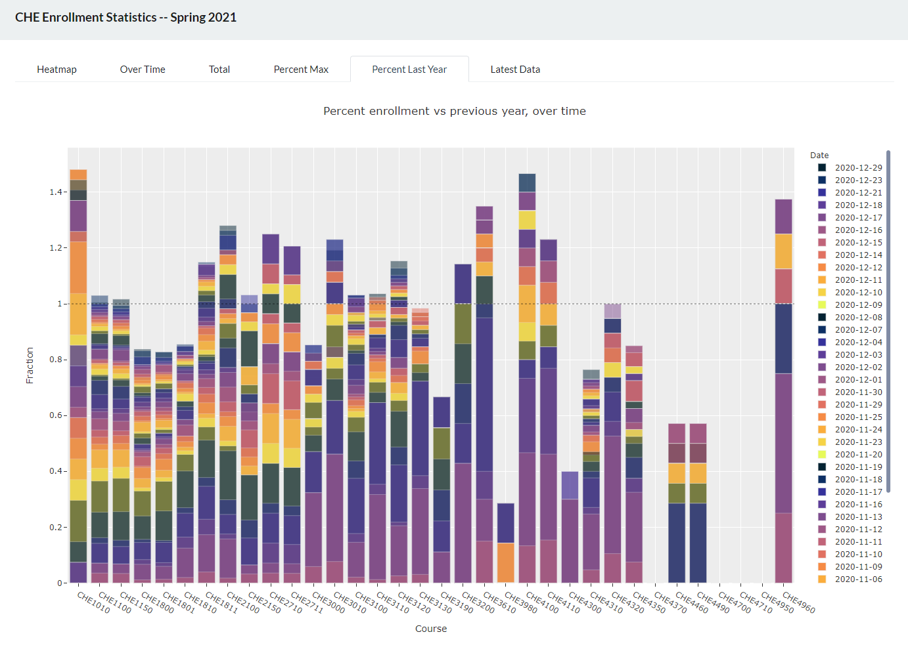

# msu-che-enrollment

An enrollment dashboard for Metropolitan State University of Denver, Department of Chemistry &amp; Biochemistry.

Built using [Plotly Dash](https://github.com/plotly/dash), data processed from [Ellucian Banner](https://www.ellucian.com/solutions/ellucian-banner) output.

## Screenshot

## Usage

Requires processed banner output files in a directory called `count`, with files in `Spring_YYYYMMDD.xlsx` filename format, as generated by this [banner enrollment dashboard tool](https://github.com/Paradoxdruid/academia-admin-automation), live at **[https://enroll.bonhamcode.com/](https://enroll.bonhamcode.com/)**.

Run locally as a flask server with `python app.py` or deploy to a webserver using `gunicorn`.

## Authors

These scripts are developed as academic software by [Dr. Andrew J. Bonham](https://github.com/Paradoxdruid) at the [Metropolitan State University of Denver](https://www.msudenver.edu/). 
